<div align="center">

# 🔄 Go-PBMO

**高性能 Protocol Buffer ↔ Model 双向转换库**

*为 gRPC/REST 网关场景精心打造的 PB-Model 转换引擎，单次转换 ~1.2µs，枚举映射 ~33ns*

<br>

[](https://github.com/kamalyes/go-pbmo)
[](LICENSE)
[](https://golang.org/)
[](https://goreportcard.com/report/github.com/kamalyes/go-pbmo)
[](https://pkg.go.dev/github.com/kamalyes/go-pbmo)

<br>

*[📖 快速开始](#快速开始)* · *[📚 详细文档](#详细文档)* · *[📊 性能基准](#性能基准)*

</div>

---

## ✨ 特性亮点

- 🚀 **高性能转换** - 单次 PB ↔ Model 转换 ~1.2µs，枚举映射 ~33ns，零内存分配热路径
- 🎯 **泛型便捷函数** - `ToPB` / `FromPB` / `ToPBs` / `FromPBs` 一行搞定，类型安全无需 reflect
- 🔄 **双向转换** - PB → Model 和 Model → PB 一致性保证
- 🗺️ **字段映射** - 支持 struct tag 和手动映射两种方式
- ⚡ **字段转换器** - 自定义字段级别转换逻辑
- ⏰ **自动时间转换** - `time.Time` ↔ `*timestamppb.Timestamp` 自动处理
- ✅ **参数校验** - 字段级校验规则（必填、长度、范围、正则、自定义）
- 📦 **批量转换** - 泛型批量 `ToPBs` / `FromPBs` / `SafeToPBs` / `SafeFromPBs`
- 🗂️ **注册中心** - `Register[M, P]()` 一行注册，`ConverterFor[M, P]()` 按需获取
- 🔢 **枚举映射** - 支持 int32 和泛型枚举映射
- 🎭 **脱敏转换** - 集成 go-toolbox/desensitize
- 🛡️ **安全转换** - 集成 go-toolbox/safe 避免 nil panic
- ⚙️ **选项模式** - Functional Options + 链式调用灵活配置

## 🏗️ 架构概览

```mermaid
graph TB
    A["🔄 go-pbmo"] --> B["🎯 泛型 API"]
    A --> C["🚀 核心转换"]
    A --> D["⚡ 扩展能力"]
    A --> E["🏗️ 基础设施"]
    A --> F["🛠️ 集成工具"]

    B --> B1["Register[M, P]<br/>一行注册"]
    B --> B2["ToPB / FromPB<br/>单条转换"]
    B --> B3["ToPBs / FromPBs<br/>批量转换"]
    B --> B4["SafeToPBs / SafeFromPBs<br/>安全批量"]

    C --> C1["📦 BidiConverter<br/>双向转换器"]
    C --> C2["📚 Batch<br/>批量转换"]
    C --> C3["🏛️ Registry<br/>注册中心"]

    D --> D1["🔧 Transformer<br/>字段转换器"]
    D --> D2["✅ Validator<br/>参数校验"]
    D --> D3["🔢 EnumMapper<br/>枚举映射"]
    D --> D4["🎭 Desensitize<br/>脱敏转换"]
    D --> D5["🛡️ SafeConverter<br/>安全转换"]

    E --> E1["❌ Errors<br/>类型化错误"]
    E --> E2["⚙️ Options<br/>选项模式"]
    E --> E3["🔍 Helpers<br/>反射工具"]
    E --> E4["⏰ Time<br/>时间转换"]

    F --> F1["syncx<br/>并发安全Map"]
    F --> F2["errorx<br/>类型化错误"]
    F --> F3["safe<br/>安全访问"]
    F --> F4["desensitize<br/>数据脱敏"]

    style A fill:#4CAF50,color:#fff
    style B fill:#E91E63,color:#fff
    style C fill:#2196F3,color:#fff
    style D fill:#FF9800,color:#fff
    style E fill:#9C27B0,color:#fff
    style F fill:#607D8B,color:#fff
```



## 🚀 快速开始

### 安装

```bash
go get github.com/kamalyes/go-pbmo
```

### 泛型 API（推荐）

泛型 API 是最简洁的使用方式，利用 `reflect.Type` 做 key + `sync.Map` 缓存，消除样板代码：

```go
package main

import (
    "fmt"
    pbmo "github.com/kamalyes/go-pbmo"
)

type UserPB struct {
    Id    uint64
    Name  string
    Email string
    Age   int32
}

type UserModel struct {
    ID    uint64 `pbmo:"Id"`
    Name  string
    Email string
    Age   int
}

func main() {
    // 一行注册（自动缓存，无需重复调用）
    pbmo.Register[UserModel, UserPB]()

    // 单条转换
    pb, _ := pbmo.ToPB[UserModel, UserPB](&UserModel{ID: 1, Name: "张三", Age: 25})
    model, _ := pbmo.FromPB[UserPB, UserModel](&UserPB{Id: 2, Name: "李四", Age: 30})

    // 批量转换
    models := []*UserModel{{ID: 1, Name: "a"}, {ID: 2, Name: "b"}}
    pbs, _ := pbmo.ToPBs[UserModel, UserPB](models)

    // 安全批量转换（不因单个失败中断）
    pbs2, result := pbmo.SafeToPBs[UserModel, UserPB](models)
    fmt.Printf("成功: %d, 失败: %d\n", result.SuccessCount, result.FailureCount)
}
```

### 传统 API（仍可用）

> ⚠️ 传统 API 已标记为 **Deprecated**，建议迁移到泛型 API

```go
// 手动创建转换器
converter := pbmo.NewBidiConverter(UserPB{}, UserModel{})

// PB -> Model
var model UserModel
converter.ConvertPBToModel(pb, &model)

// Model -> PB
var pb2 UserPB
converter.ConvertModelToPB(model2, &pb2)

// 批量转换（已废弃，请用 ToPBs / FromPBs）
var models []UserModel
converter.BatchConvertPBToModel(pbs, &models) // Deprecated
```

### 带选项配置

```go
// 泛型方式
pbmo.RegisterWith[UserModel, UserPB](
    pbmo.WithAutoTimeConversion(true),
    pbmo.WithValidation(true),
    pbmo.WithFieldMapping("ID", "Id"),
    pbmo.WithDesensitize(true),
)

// 传统方式
converter := pbmo.NewBidiConverter(PB{}, Model{},
    pbmo.WithAutoTimeConversion(true),
    pbmo.WithValidation(true),
)
```

### 链式调用

```go
converter := pbmo.NewBidiConverter(UserPB{}, UserModel{}).
    WithAutoTimeConversion(true).
    WithValidation(true).
    WithFieldMapping("ID", "Id").
    WithDesensitize(true)
```

## 📋 泛型 API 速查表

| 函数 | 签名 | 说明 |
|------|------|------|
| `Register` | `Register[M, P]() *BidiConverter` | 注册转换对（默认配置） |
| `RegisterWith` | `RegisterWith[M, P](opts...) *BidiConverter` | 注册转换对（自定义配置） |
| `ToPB` | `ToPB[M, P](m *M) (*P, error)` | Model → PB |
| `FromPB` | `FromPB[P, M](pb *P) (*M, error)` | PB → Model |
| `ToPBs` | `ToPBs[M, P](models []*M) ([]*P, error)` | 批量 Model → PB，遇错即停 |
| `FromPBs` | `FromPBs[P, M](pbs []*P) ([]*M, error)` | 批量 PB → Model，遇错即停 |
| `SafeToPBs` | `SafeToPBs[M, P](models []*M) ([]*P, *BatchResult)` | 安全批量 Model → PB |
| `SafeFromPBs` | `SafeFromPBs[P, M](pbs []*P) ([]*M, *BatchResult)` | 安全批量 PB → Model |
| `ConverterFor` | `ConverterFor[M, P]() *BidiConverter` | 获取已注册的转换器 |

## 🔄 迁移指南

| 旧 API（Deprecated） | 新 API（推荐） |
|----------------------|---------------|
| `NewBidiConverter(PB{}, Model{})` + `RegisterConverter(c)` | `Register[Model, PB]()` |
| `converter.ConvertModelToPB(m, &pb)` | `ToPB[Model, PB](m)` |
| `converter.ConvertPBToModel(pb, &model)` | `FromPB[PB, Model](pb)` |
| `converter.BatchConvertModelToPB(models, &pbs)` | `ToPBs[Model, PB](models)` |
| `converter.BatchConvertPBToModel(pbs, &models)` | `FromPBs[PB, Model](pbs)` |
| `converter.SafeBatchConvertModelToPB(models, &pbs)` | `SafeToPBs[Model, PB](models)` |
| `converter.SafeBatchConvertPBToModel(pbs, &models)` | `SafeFromPBs[PB, Model](pbs)` |
| `GetConverter(pbType, modelType)` | `ConverterFor[Model, PB]()` |
| `ConvertPBToModel(pb, &model)` | `FromPB[PB, Model](pb)` |
| `ConvertModelToPB(model, &pb)` | `ToPB[Model, PB](model)` |

## 🧰 模块一览

| 模块 | 文件 | 功能描述 | 使用场景 |
|------|------|----------|----------|
| 🎯 泛型 API | [generic.go](generic.go) | 一行注册、一行转换 | **推荐首选** |
| 🔄 核心转换 | [converter.go](converter.go) | BidiConverter 双向转换 | PB ↔ Model 转换 |
| 📦 批量转换 | [batch.go](batch.go) | 批量转换、安全批量 | 列表数据转换 |
| 🗂️ 注册中心 | [registry.go](registry.go) | 转换器统一管理 | 多类型转换场景 |
| ⚡ 字段转换 | [transform.go](transform.go) | 字段级自定义转换 | 数据格式化、类型适配 |
| ✅ 参数校验 | [validate.go](validate.go) | 字段校验规则 | 数据验证 |
| 🔢 枚举映射 | [enum.go](enum.go) | int32/泛型枚举映射 | 枚举类型转换 |
| 🎭 脱敏转换 | [desensitize.go](desensitize.go) | 数据脱敏 | 隐私保护 |
| 🛡️ 安全转换 | [safe.go](safe.go) | nil 安全转换 | 防止 panic |
| ⏰ 时间转换 | [time.go](time.go) | Time ↔ Timestamp | 时间字段处理 |
| 🔧 辅助函数 | [helpers.go](helpers.go) | 反射工具、类型判断 | 内部使用 |
| ❌ 错误定义 | [errors.go](errors.go) | 类型化错误体系 | 错误处理 |
| ⚙️ 选项模式 | [option.go](option.go) | Functional Options | 配置管理 |

## 📊 性能基准

基于真实 `go test -bench=. -benchmem -count=5` 测试结果（5组取中位数）：

> **单位说明**: `ns` = 纳秒（10⁻⁹秒），`µs` = 微秒（10⁻⁶秒，1µs = 1000ns），`ms` = 毫秒（10⁻³秒，1ms = 1000µs）

**测试环境**: Windows AMD64 · Go 1.25 · Intel i5-9300H @ 2.40GHz

### 核心转换

| 场景 | 中位数耗时 | 内存分配 | 分配次数 |
|------|-----------|----------|----------|
| 简单 PB→Model | **1.23µs** | 24 B | 1 |
| 简单 Model→PB | **1.33µs** | 24 B | 1 |
| 带字段映射 PB→Model | **2.05µs** | 48 B | 1 |
| 带 Tag 映射 PB→Model | **4.70µs** | 96 B | 1 |
| 带字段转换器 | **2.81µs** | 72 B | 4 |
| 完整模型 PB→Model | **6.68µs** | 192 B | 2 |
| 完整模型 Model→PB | **5.49µs** | 192 B | 2 |
| 并发 PB→Model | **1.08µs** | 48 B | 2 |

### 批量转换

| 场景 | 中位数耗时 | 内存分配 | 分配次数 |
|------|-----------|----------|----------|
| 批量 100 条 PB→Model | **244µs** | 7.4 KB | 204 |
| 批量 1000 条 PB→Model | **1.95ms** | 71 KB | 2004 |
| 安全批量 100 条 | **261µs** | 25 KB | 313 |

### 注册中心与转换器

| 场景 | 中位数耗时 | 内存分配 | 分配次数 |
|------|-----------|----------|----------|
| 注册中心注册 | **3.71µs** | 192 B | 8 |
| 注册中心查找 | **1.36µs** | 64 B | 3 |
| 通过注册中心转换 | **2.73µs** | 88 B | 4 |
| 创建 BidiConverter | **1.72µs** | 416 B | 7 |
| 带选项创建 BidiConverter | **6.93µs** | 944 B | 12 |
| 字段转换器应用 | **4.28µs** | 48 B | 3 |
| 安全转换器 PB→Model | **1.78µs** | 24 B | 1 |

### 枚举映射

| 场景 | 中位数耗时 | 内存分配 | 分配次数 |
|------|-----------|----------|----------|
| EnumMapper.Map | **33ns** | 0 B | 0 |
| GenericEnumMapper.Map | **36ns** | 0 B | 0 |
| AutoEnumConverter.Convert | **52ns** | 0 B | 0 |

### 校验器

| 场景 | 中位数耗时 | 内存分配 | 分配次数 |
|------|-----------|----------|----------|
| Validator.Validate | **2.09µs** | 36 B | 3 |

> 💡 运行 `go test -bench=. -benchmem -count=5` 查看完整基准测试结果

## 🧪 测试

```bash
# 运行所有测试
go test ./...

# 运行基准测试
go test -bench=. -benchmem

# 运行指定模块测试
go test -run TestConverter -v
```

## 📚 详细文档

| 编号 | 文档 | 说明 |
|------|------|------|
| 01 | [快速开始](docs/01.快速开始.md) | 安装、泛型 API、核心 API |
| 02 | [字段映射](docs/02.字段映射.md) | struct tag、手动映射、优先级 |
| 03 | [字段转换器](docs/03.字段转换器.md) | TransformerFunc、注册、常见场景 |
| 04 | [参数校验](docs/04.参数校验.md) | FieldRule、ValidationErrors、中间件集成 |
| 05 | [批量转换](docs/05.批量转换.md) | 泛型批量、安全批量、BatchResult |
| 06 | [注册中心](docs/06.注册中心.md) | Registry、泛型注册、多类型管理 |
| 07 | [枚举映射](docs/07.枚举映射.md) | EnumMapper、GenericEnumMapper、AutoEnumConverter |
| 08 | [脱敏转换](docs/08.脱敏转换.md) | DesensitizeConverter、脱敏 Tag、自定义脱敏器 |
| 09 | [安全转换](docs/09.安全转换.md) | SafeConverter、安全字段访问、SafeAccess |
| 10 | [时间转换](docs/10.时间转换.md) | 自动时间转换、手动转换函数 |
| 11 | [选项模式](docs/11.选项模式.md) | Functional Options、链式调用、常见组合 |
| 12 | [错误处理](docs/12.错误处理.md) | 类型化错误体系、错误判断、最佳实践 |

## 📄 许可证

Copyright (c) 2026 kamalyes. All Rights Reserved.
