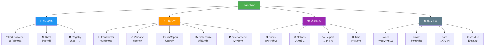
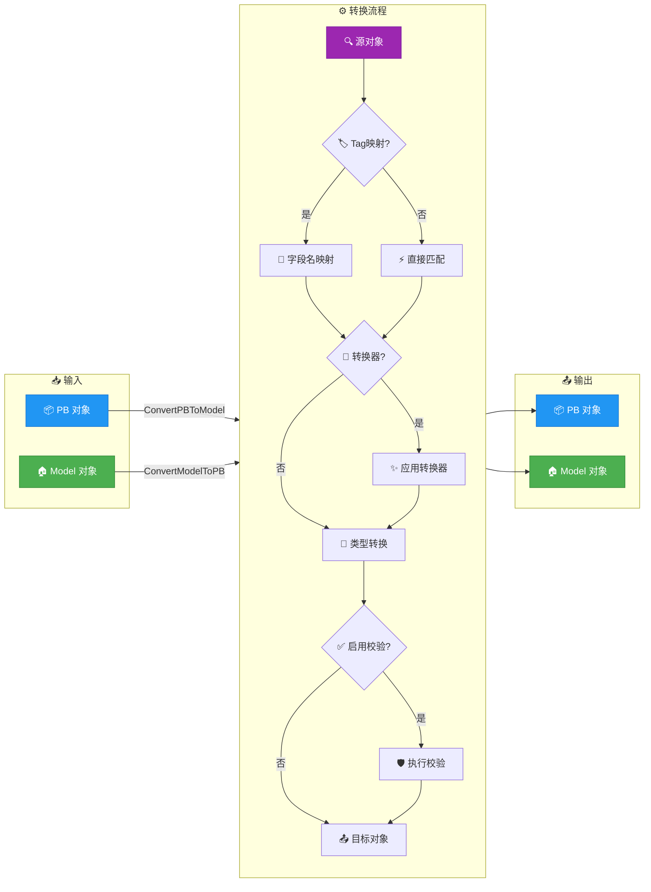

<div align="center">

# 🔄 Go-PBMO

**高性能 Protocol Buffer ↔ Model 双向转换库**

*为 gRPC/REST 网关场景精心打造的 PB-Model 转换引擎，单次转换 ~1.2µs，枚举映射 ~33ns*

<br>

[](https://github.com/kamalyes/go-pbmo)
[](LICENSE)
[](https://golang.org/)
[](https://goreportcard.com/report/github.com/kamalyes/go-pbmo)
[](https://pkg.go.dev/github.com/kamalyes/go-pbmo)

<br>

*[📖 快速开始](#快速开始)* · *[🎯 性能测试](#性能基准)* · *[🧪 测试覆盖](#测试)*

</div>

---

## ✨ 特性亮点

- 🚀 **高性能转换** - 单次 PB ↔ Model 转换 ~1.2µs，枚举映射 ~33ns，零内存分配热路径
- 🔄 **双向转换** - PB → Model 和 Model → PB 一致性保证
- 🗺️ **字段映射** - 支持 struct tag 和手动映射两种方式
- ⚡ **字段转换器** - 自定义字段级别转换逻辑
- ⏰ **自动时间转换** - `time.Time` ↔ `*timestamppb.Timestamp` 自动处理
- ✅ **参数校验** - 字段级校验规则（必填、长度、范围、正则、自定义）
- 📦 **批量转换** - 批量 PB ↔ Model 转换，含安全批量模式
- 🗂️ **注册中心** - 统一管理多个转换器实例，全局便捷函数
- 🔢 **枚举映射** - 支持 int32 和泛型枚举映射
- 🎭 **脱敏转换** - 集成 go-toolbox/desensitize
- 🛡️ **安全转换** - 集成 go-toolbox/safe 避免 nil panic
- ⚙️ **选项模式** - Functional Options 灵活配置

## 🏗️ 架构概览



## 🔄 转换流程



## 🧰 模块一览

| 模块 | 文件 | 功能描述 | 使用场景 |
|------|------|----------|----------|
| 🔄 核心转换 | [converter.go](converter.go) | BidiConverter 双向转换 | PB ↔ Model 转换 |
| 📦 批量转换 | [batch.go](batch.go) | 批量转换、安全批量 | 列表数据转换 |
| 🗂️ 注册中心 | [registry.go](registry.go) | 转换器统一管理 | 多类型转换场景 |
| ⚡ 字段转换 | [transform.go](transform.go) | 字段级自定义转换 | 数据格式化、类型适配 |
| ✅ 参数校验 | [validate.go](validate.go) | 字段校验规则 | 数据验证 |
| 🔢 枚举映射 | [enum.go](enum.go) | int32/泛型枚举映射 | 枚举类型转换 |
| 🎭 脱敏转换 | [desensitize.go](desensitize.go) | 数据脱敏 | 隐私保护 |
| 🛡️ 安全转换 | [safe.go](safe.go) | nil 安全转换 | 防止 panic |
| ⏰ 时间转换 | [time.go](time.go) | Time ↔ Timestamp | 时间字段处理 |
| 🔧 辅助函数 | [helpers.go](helpers.go) | 反射工具、类型判断 | 内部使用 |
| ❌ 错误定义 | [errors.go](errors.go) | 类型化错误体系 | 错误处理 |
| ⚙️ 选项模式 | [option.go](option.go) | Functional Options | 配置管理 |

## 🚀 快速开始

### 安装

```bash
go get github.com/kamalyes/go-pbmo
```

### 基础用法

```go
package main

import (
    "fmt"
    pbmo "github.com/kamalyes/go-pbmo"
)

type UserPB struct {
    Id    uint64
    Name  string
    Email string
    Age   int32
}

type UserModel struct {
    ID    uint64 `pbmo:"Id"`
    Name  string
    Email string
    Age   int
}

func main() {
    converter := pbmo.NewBidiConverter(UserPB{}, UserModel{})

    // PB -> Model
    pb := UserPB{Id: 1, Name: "张三", Email: "test@example.com", Age: 25}
    var model UserModel
    converter.ConvertPBToModel(pb, &model)

    // Model -> PB
    model2 := UserModel{ID: 2, Name: "李四", Age: 30}
    var pb2 UserPB
    converter.ConvertModelToPB(model2, &pb2)
}
```

### 带选项配置

```go
converter := pbmo.NewBidiConverter(PB{}, Model{},
    pbmo.WithAutoTimeConversion(true),
    pbmo.WithValidation(true),
    pbmo.WithFieldMapping("ID", "Id"),
    pbmo.WithDesensitize(true),
)
```

### 批量转换

```go
pbs := []UserPB{{Id: 1, Name: "张三"}, {Id: 2, Name: "李四"}}
var models []UserModel
converter.BatchConvertPBToModel(pbs, &models)
```

### 注册中心

```go
registry := pbmo.NewRegistry()
registry.MustRegister(converter)

// 全局便捷函数
pbmo.MustRegisterConverter(converter)
pbmo.ConvertPBToModel(pb, &model)
```

## 📊 性能基准

基于真实 `go test -bench=. -benchmem -count=5` 测试结果（5组取中位数）：

> **单位说明**: `ns` = 纳秒（10⁻⁹秒），`µs` = 微秒（10⁻⁶秒，1µs = 1000ns），`ms` = 毫秒（10⁻³秒，1ms = 1000µs）

**测试环境**: Windows AMD64 · Go 1.25 · Intel i5-9300H @ 2.40GHz

### 核心转换

| 场景 | 中位数耗时 | 内存分配 | 分配次数 |
|------|-----------|----------|----------|
| 简单 PB→Model | **1.23µs** | 24 B | 1 |
| 简单 Model→PB | **1.33µs** | 24 B | 1 |
| 带字段映射 PB→Model | **2.05µs** | 48 B | 1 |
| 带 Tag 映射 PB→Model | **4.70µs** | 96 B | 1 |
| 带字段转换器 | **2.81µs** | 72 B | 4 |
| 完整模型 PB→Model | **6.68µs** | 192 B | 2 |
| 完整模型 Model→PB | **5.49µs** | 192 B | 2 |
| 并发 PB→Model | **1.08µs** | 48 B | 2 |

### 批量转换

| 场景 | 中位数耗时 | 内存分配 | 分配次数 |
|------|-----------|----------|----------|
| 批量 100 条 PB→Model | **244µs** | 7.4 KB | 204 |
| 批量 1000 条 PB→Model | **1.95ms** | 71 KB | 2004 |
| 安全批量 100 条 | **261µs** | 25 KB | 313 |

### 注册中心与转换器

| 场景 | 中位数耗时 | 内存分配 | 分配次数 |
|------|-----------|----------|----------|
| 注册中心注册 | **3.71µs** | 192 B | 8 |
| 注册中心查找 | **1.36µs** | 64 B | 3 |
| 通过注册中心转换 | **2.73µs** | 88 B | 4 |
| 创建 BidiConverter | **1.72µs** | 416 B | 7 |
| 带选项创建 BidiConverter | **6.93µs** | 944 B | 12 |
| 字段转换器应用 | **4.28µs** | 48 B | 3 |
| 安全转换器 PB→Model | **1.78µs** | 24 B | 1 |

### 枚举映射

| 场景 | 中位数耗时 | 内存分配 | 分配次数 |
|------|-----------|----------|----------|
| EnumMapper.Map | **33ns** | 0 B | 0 |
| GenericEnumMapper.Map | **36ns** | 0 B | 0 |
| AutoEnumConverter.Convert | **52ns** | 0 B | 0 |

### 校验器

| 场景 | 中位数耗时 | 内存分配 | 分配次数 |
|------|-----------|----------|----------|
| Validator.Validate | **2.09µs** | 36 B | 3 |

> 💡 运行 `go test -bench=. -benchmem -count=5` 查看完整基准测试结果

## 🧪 测试

```bash
# 运行所有测试
go test ./...

# 运行基准测试
go test -bench=. -benchmem

# 运行指定模块测试
go test -run TestConverter -v
```

## 🤝 与 go-rpc-gateway 集成

go-pbmo 可直接替换 go-rpc-gateway 中的旧 pbmo 模块，主要 API 完全兼容：

```go
// 旧 import
// "github.com/kamalyes/go-rpc-gateway/pbmo"

// 新 import
pbmo "github.com/kamalyes/go-pbmo"
```

## 📄 许可证

Copyright (c) 2026 kamalyes. All Rights Reserved.
