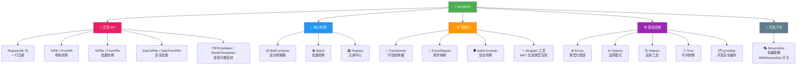

<div align="center">

# 🔄 Go-PBMO

**高性能 Protocol Buffer ↔ Model 双向转换库**

*为 gRPC/REST 网关场景精心打造的 PB-Model 转换引擎，热路径零分配，批量/map 字段场景反超原生代码，分配次数普遍低于原生手写*

<br>

[](https://github.com/kamalyes/go-pbmo)
[](LICENSE)
[](https://golang.org/)
[](https://goreportcard.com/report/github.com/kamalyes/go-pbmo)
[](https://pkg.go.dev/github.com/kamalyes/go-pbmo)

<br>

*[📖 快速开始](#快速开始)* · *[📚 详细文档](#详细文档)* · *[📊 性能基准](#性能基准)*

</div>

---

## ✨ 特性亮点

- 🪶 **核心零三方依赖** - 主模块只依赖 protobuf 本身，`go.mod` 不再出现任何其它第三方库
- 🚀 **高性能转换** - 稳态热路径零分配，unsafe 零拷贝 + 反射缓存 + 类型特化三引擎，批量与 map 字段场景反超原生，分配次数普遍低于原生手写
- 🎯 **泛型便捷函数** - `ToPB` / `FromPB` / `ToPBs` / `FromPBs` 一行搞定，类型安全无需 reflect
- 🔄 **双向转换** - PB → Model 和 Model → PB 一致性保证
- 🗺️ **字段映射** - 支持 struct tag 和手动映射两种方式
- ⚡ **字段转换器** - 自定义字段级别转换逻辑
- ⏰ **自动时间转换** - `time.Time` ↔ `*timestamppb.Timestamp` 自动处理
- 📦 **批量转换** - 泛型批量 `ToPBs` / `FromPBs`，安全批量 `SafeToPBs` / `SafeFromPBs` 支持值切片与指针切片自动适配
- 🗂️ **注册中心** - `Register[M, P]()` 一行注册，`ConverterFor[M, P]()` 按需获取
- 🔢 **枚举映射** - 支持 int32 和泛型枚举映射
- 🎭 **单遍脱敏** - 编织进拷贝计划，`WithDesensitize(true)` 开启（默认关闭），无 tag 的类型零代价
- 🛡️ **安全转换** - `SafeConverter` 拦截 nil 与 typed-nil 指针，避免 panic
- 🧩 **更新构建器** - `NewUpdates()` 链式构建局部更新，`PBToUpdates` / `ModelToUpdates` 一行输出 GORM Updates 字典
- 🎁 **WKT 包装类型** - `wrapperspb` 包装类型与原生值/指针双向互转工具
- ⚙️ **选项模式** - Functional Options + 链式调用灵活配置

## 🏗️ 架构概览


```mermaid
graph TB
    A["🔄 go-pbmo"] --> B["🎯 泛型 API"]
    A --> C["🚀 核心转换"]
    A --> D["⚡ 扩展能力"]
    A --> E["🏗️ 基础设施"]
    A --> F["🧩 可选子包"]

    B --> B1["Register[M, P]<br/>一行注册"]
    B --> B2["ToPB / FromPB<br/>单条转换"]
    B --> B3["ToPBs / FromPBs<br/>批量转换"]
    B --> B4["SafeToPBs / SafeFromPBs<br/>安全批量"]
    B --> B5["PBToUpdates / ModelToUpdates<br/>更新字典直转"]

    C --> C1["📦 BidiConverter<br/>双向转换器"]
    C --> C2["📚 Batch<br/>批量转换"]
    C --> C3["🏛️ Registry<br/>注册中心"]

    D --> D1["🔧 Transformer<br/>字段转换器"]
    D --> D3["🔢 EnumMapper<br/>枚举映射"]
    D --> D4["🛡️ SafeConverter<br/>安全转换"]
    D --> D5["🎁 Wrapper 工具<br/>WKT 包装类型互转"]

    E --> E1["❌ Errors<br/>类型化错误"]
    E --> E2["⚙️ Options<br/>选项模式"]
    E --> E3["🔍 Helpers<br/>反射工具"]
    E --> E4["⏰ Time<br/>时间转换"]
    E --> E5["🗂️ syncMap<br/>并发安全缓存"]

    F --> F1["🎭 Desensitize<br/>单遍脱敏<br/>WithDesensitize 开关"]

    style A fill:#4CAF50,color:#fff
    style B fill:#E91E63,color:#fff
    style C fill:#2196F3,color:#fff
    style D fill:#FF9800,color:#fff
    style E fill:#9C27B0,color:#fff
    style F fill:#607D8B,color:#fff
```

## 🚀 快速开始

### 安装

```bash
go get github.com/kamalyes/go-pbmo
```

第三方依赖只有两个模块、34 个包：

| 模块 | 包数 | 为什么需要 |
|------|------|------|
| `google.golang.org/protobuf` | 33 | 本库的主题，无法也不该去掉 |
| `go-toolbox/pkg/desensitize` | 1 | 单遍脱敏的规则与脱敏器，本身零第三方依赖 |

> 💡 脱敏一度被放在独立嵌套模块 `desensitizex` 里，为的是隔离当时位于
> go-toolbox 的脱敏实现（它会拖进 go-argus 等十余个包）
> 脱敏迁到零依赖的 go-desensitize 之后，隔离已经没有对象可隔离，而独立模块
> 要单独打 tag、单独维护 `go.mod` 与 `replace`，代价高于收益，因此合回主模块
> 现在脱敏编织进拷贝计划，由 `WithDesensitize` 开关控制，默认关闭，
> 无 `desensitize` tag 的类型拷贝计划与引入脱敏前逐字节相同

### 泛型 API（推荐）

泛型 API 是最简洁的使用方式，利用 `reflect.Type` 做 key + `sync.Map` 缓存，消除样板代码：

```go
package main

import (
    "fmt"
    pbmo "github.com/kamalyes/go-pbmo"
)

type UserPB struct {
    Id    uint64
    Name  string
    Email string
    Age   int32
}

type UserModel struct {
    ID    uint64 `pbmo:"Id"`
    Name  string
    Email string
    Age   int
}

func main() {
    // 一行注册（自动缓存，无需重复调用）
    pbmo.Register[UserModel, UserPB]()

    // 单条转换
    pb, _ := pbmo.ToPB[UserModel, UserPB](&UserModel{ID: 1, Name: "张三", Age: 25})
    model, _ := pbmo.FromPB[UserPB, UserModel](&UserPB{Id: 2, Name: "李四", Age: 30})

    // 批量转换
    models := []*UserModel{{ID: 1, Name: "a"}, {ID: 2, Name: "b"}}
    pbs, _ := pbmo.ToPBs[UserModel, UserPB](models)

    // 安全批量转换（不因单个失败中断，支持 []M 值切片与 []*M 指针切片）
    pbs2, result := pbmo.SafeToPBs[UserModel, UserPB](models)
    fmt.Printf("成功: %d, 失败: %d\n", result.SuccessCount, result.FailureCount)
}
```

### 非泛型 API（仍受支持）

> `BidiConverter` 的方法没有废弃，需要在运行时才知道类型时仍然用它
> 批量方法与包级便捷函数已删除，对照关系见文末

```go
// 手动创建转换器
converter := pbmo.NewBidiConverter(UserPB{}, UserModel{})

// PB -> Model
var model UserModel
converter.ConvertPBToModel(pb, &model)

// Model -> PB
var pb2 UserPB
converter.ConvertModelToPB(model2, &pb2)

// 批量转换
models, err := pbmo.FromPBs[UserPB, UserModel](pbs)
```

### 带选项配置

```go
// 泛型方式
pbmo.RegisterWith[UserModel, UserPB](
    pbmo.WithAutoTimeConversion(true),
    pbmo.WithFieldMapping("ID", "Id"),
    pbmo.WithDesensitize(true),
)

// 传统方式
converter := pbmo.NewBidiConverter(PB{}, Model{},
    pbmo.WithAutoTimeConversion(true),
)
```

### 链式调用

```go
converter := pbmo.NewBidiConverter(UserPB{}, UserModel{}).
    WithAutoTimeConversion(true).
    WithFieldMapping("ID", "Id").
    WithDesensitize(true)
```

### 更新字段构建器

`NewUpdates()` 用于构建 `map[string]interface{}`，适合传给 GORM `Updates` 或仓储层局部更新方法
JSON 数组字段请使用 `SetJSONSlice`，避免把 Go slice 作为标量值写入 JSON 列

```go
updates := pbmo.NewUpdates().
    SetStringVal("url", req.Url).
    SetInt32Val("sort_order", wrapperspb.Int32(req.SortOrder)).
    SetJSONSlice("display_pages", req.DisplayPages).
    Build()
```

`SetJSONSlice` 仅处理 slice/array，nil slice 会被跳过，非 nil 空切片会写入 `[]`

### 更新字典直转

`PBToUpdates` / `ModelToUpdates` 一行将消息或结构体转为更新字典，自动跳过零值，适合直接传给 GORM `Updates`
字段 key 与偏移按类型缓存于更新计划，热路径零 tag 解析：

```go
// PB 按 protobuf json tag 名（snake_case）输出，自动解包 wrapper 类型
updates := pbmo.PBToUpdates(req)

// Model 按 gorm column tag 或 json tag 输出，跳过零值与不可导出字段
updates := pbmo.ModelToUpdates(&user)

db.Model(&User{}).Where("id = ?", 1).Updates(updates)
```

## 📋 泛型 API 速查表

| 函数 | 签名 | 说明 |
|------|------|------|
| `Register` | `Register[M, P]() *BidiConverter` | 注册转换对（默认配置） |
| `RegisterWith` | `RegisterWith[M, P](opts...) *BidiConverter` | 注册转换对（自定义配置） |
| `ToPB` | `ToPB[M, P](m *M) (*P, error)` | Model → PB |
| `FromPB` | `FromPB[P, M](pb *P) (*M, error)` | PB → Model |
| `ToPBs` | `ToPBs[M, P](models []*M) ([]*P, error)` | 批量 Model → PB，遇错即停 |
| `FromPBs` | `FromPBs[P, M](pbs []*P) ([]*M, error)` | 批量 PB → Model，遇错即停 |
| `SafeToPBs` | `SafeToPBs[M, P](models []M) ([]*P, *BatchResult)` | 安全批量 Model → PB，支持 `[]M` 与 `[]*M` 自动适配 |
| `SafeFromPBs` | `SafeFromPBs[P, M](pbs []*P) ([]*M, *BatchResult)` | 安全批量 PB → Model |
| `ConverterFor` | `ConverterFor[M, P]() *BidiConverter` | 获取已注册的转换器 |
| `PBToUpdates` | `PBToUpdates[P](pb *P) map[string]interface{}` | PB → 更新字典，protobuf json tag 作 key，跳过零值并解包 wrapper |
| `ModelToUpdates` | `ModelToUpdates[M](m *M) map[string]interface{}` | Model → 更新字典，gorm column/json tag 作 key，跳过零值 |

## 🔄 迁移指南

### v0.3.0 破坏性变更：核心模块去三方依赖

主模块原先依赖 go-toolbox 与 go-argus，使用者无论用不用脱敏，都要把整套工具包
拉进构建图，依赖闭包 53 个包、5 个模块
现在只剩 protobuf 与零依赖的 go-toolbox/pkg/desensitize，34 个包、2 个模块；
受影响的公开 API 如下：

| 原 API | 现在怎么写 | 为什么 |
|------|------|------|
| `pbmo.DesensitizeConverter` | `NewBidiConverter(..., WithDesensitize(true))` | 脱敏编织进拷贝计划，不再需要专门的转换器类型 |
| `pbmo.NewDesensitizeConverter(...)` | 同上 | 同上 |
| `dc.ConvertPBToModelWithDesensitize(...)` | `c.ConvertPBToModel(...)` | 开关决定是否脱敏，不再有带后缀的方法 |
| `dc.ConvertModelToPBWithDesensitize(...)` | `c.ConvertModelToPB(...)` | 同上 |
| `pbmo.ApplyDesensitization(obj)` | `desensitize.Desensitization(obj)` | 整对象脱敏属于输出层，直接用上游 |
| `pbmo.RegisterDesensitizer(t, d)` | `desensitize.RegisterDesensitizer(t, d)` | 同上 |
| `pbmo.DesensitizeField(v, t)` | `desensitize.Desensitize(v, t)` | 同上 |
| `pbmo.SafeGetField(obj, "F")` | `safe.New(obj).Field("F")` | 原本只是一行转发，没有自己的语义 |
| `pbmo.SafeGetNestedField(obj, p)` | `safe.New(obj).At(p)` | 同上 |
| `sc.SafeFieldAccess(obj, f...)` | 逐级 `safe.New(obj).Field(f)` | 同上 |

上表里 `desensitize` 指 `go-toolbox/pkg/desensitize`，
`safe` 指 `go-toolbox/pkg/safe`，两者都零第三方依赖

一度存在的 `desensitizex` 子模块已经取消：脱敏现在直接在主模块里完成，
由 `WithDesensitize` 开关控制，无 tag 的类型零代价，不必再为它单开一个模块

未受影响的部分：

- 八个 `ErrType*` 错误码数值不变（20000 ~ 20007），错误消息前缀逐字不变
- 预定义错误变量、`New*Error` 构造函数、`Is*Error` 判断签名不变
- 错误类型由 `errorx.ErrorType` / `errorx.BaseError` 换成本包的 `ErrorType` / `Error`，
  `errors.Is` 与 `errors.As` 用法不变，新增导出的 `ClassifyError` 可直接取分类
- `SetJSON` / `SetJSONVal` / `SetJSONSlice` 的输出逐字节不变
- `PBToUpdates` / `ModelToUpdates` 的字段 key 解析与零值跳过规则不变
- `SafeConverter` 及其 `SafeConvert*` 方法留在主模块，没有依赖

| 已删除的 API | 替代品 |
|--------------|--------|
| `NewBidiConverter(PB{}, Model{})` + `RegisterConverter(c)`（已删除） | `Register[Model, PB]()` |
| `converter.ConvertModelToPB(m, &pb)` | `ToPB[Model, PB](m)` |
| `converter.ConvertPBToModel(pb, &model)` | `FromPB[PB, Model](pb)` |
| `converter.BatchConvertModelToPB(models, &pbs)`（已删除） | `ToPBs[Model, PB](models)` |
| `converter.BatchConvertPBToModel(pbs, &models)`（已删除） | `FromPBs[PB, Model](pbs)` |
| `converter.SafeBatchConvertModelToPB(models, &pbs)`（已删除） | `SafeToPBs[Model, PB](models)` |
| `converter.SafeBatchConvertPBToModel(pbs, &models)`（已删除） | `SafeFromPBs[PB, Model](pbs)` |
| `GetConverter(pbType, modelType)`（已删除） | `ConverterFor[Model, PB]()` |
| `ConvertPBToModel(pb, &model)` | `FromPB[PB, Model](pb)` |
| `ConvertModelToPB(model, &pb)` | `ToPB[Model, PB](model)` |

## 🧰 模块一览

| 模块 | 文件 | 功能描述 | 使用场景 |
|------|------|----------|----------|
| 🎯 泛型 API | [generic.go](generic.go) | 一行注册、一行转换 | **推荐首选** |
| 🔄 核心转换 | [converter.go](converter.go) | BidiConverter 双向转换 | PB ↔ Model 转换 |
| 📦 批量转换 | [batch.go](batch.go) | 批量转换、安全批量 | 列表数据转换 |
| 🗂️ 注册中心 | [registry.go](registry.go) | 转换器统一管理 | 多类型转换场景 |
| ⚡ 字段转换 | [transform.go](transform.go) | 字段级自定义转换 | 数据格式化、类型适配 |
| 🔢 枚举映射 | [enum.go](enum.go) | int32/泛型枚举映射 | 枚举类型转换 |
| 🎭 单遍脱敏 | [desensitize.go](desensitize.go) | 编织进拷贝计划的字段脱敏 | 隐私保护 |
| 🛡️ 安全转换 | [safe.go](safe.go) | nil 安全转换 | 防止 panic |
| ⏰ 时间转换 | [time.go](time.go) | Time ↔ Timestamp | 时间字段处理 |
| 🧩 更新构建器 | [updates.go](updates.go) | 链式构建局部更新字段 | GORM Updates、JSON 字段更新 |
| 📋 更新计划 | [updates_plan.go](updates_plan.go) | 更新字典字段计划缓存 | PBToUpdates / ModelToUpdates 热路径 |
| 🎁 包装类型 | [wrappers.go](wrappers.go) | WKT 包装类型互转工具 | wrapperspb ↔ 原生值/指针 |
| 🔧 辅助函数 | [helpers.go](helpers.go) | 反射工具、类型判断 | 内部使用 |
| 🗂️ 并发映射 | [syncmap.go](syncmap.go) | 字段缓存、计划缓存、注册中心的并发容器 | 内部使用 |
| 🏷️ 字段 key | [fieldkey.go](fieldkey.go) | gorm / protobuf / json tag 解析 | 内部使用 |
| 🧮 空值判断 | [empty.go](empty.go) | 更新字典跳过零值字段 | 内部使用 |
| 🧾 JSON 辅助 | [jsonx.go](jsonx.go) | JSON 列规范化与切片编码 | 内部使用 |
| ❌ 错误定义 | [errors.go](errors.go) | 类型化错误体系 | 错误处理 |
| ⚙️ 选项模式 | [option.go](option.go) | Functional Options | 配置管理 |

## 📊 性能基准

基于 `go test -bench=. -benchmem -count=3` 实测，与手写原生转换代码对比，完整数据见 [go-pbmo-benchmark](https://github.com/kamalyes/go-pbmo-benchmark)：

> **单位说明**: `ns` = 纳秒（10⁻⁹秒），`µs` = 微秒（10⁻⁶秒，1µs = 1000ns）；对比列 `PBMO/Native`，**< 1 表示 PBMO 反超**
> **测试环境**: Linux AMD64 · Go 1.25 · AMD EPYC 9V45（GitHub Actions CI），更新字典与注册中心为本机补充实测

### 核心转换（PBMO vs Native）

| 模型（结构特征） | 场景 | PBMO | Native | 对比 | 胜出 | 内存 | 分配 |
|------|------|------|------|------|------|------|------|
| Simple（8 字段平铺） | PB→Model | 26.1 ns | 20.1 ns | 1.30x | Native | 48 B | 1 |
| Simple（8 字段平铺） | Model→PB | 25.4 ns | 22.0 ns | 1.15x | Native | 48 B | 1 |
| Mapped（字段映射） | PB→Model | 25.9 ns | 20.3 ns | 1.28x | Native | 48 B | 1 |
| Mapped（字段映射） | Model→PB | 25.5 ns | 20.5 ns | 1.24x | Native | 48 B | 1 |
| Medium（含切片/时间） | PB→Model | 37.4 ns | 28.2 ns | 1.33x | Native | 96 B | 1 |
| Full（多类型混合） | PB→Model | 87.1 ns | 70.5 ns | 1.24x | Native | 184 B | 2 |
| Full（多类型混合） | Model→PB | **120.2 ns** | 135.0 ns | **0.89x** | **PBMO** | 416 B | 2 |
| Large（大结构） | PB→Model | 104.9 ns | 76.3 ns | 1.38x | Native | 296 B | 2 |
| Large（大结构） | Model→PB | **126.9 ns** | 133.4 ns | **0.95x** | **PBMO** | 432 B | 2 |
| Huge30（30 字段） | PB→Model | 100.6 ns | 100.9 ns | 1.00x | 持平 | 448 B | 1 |
| Huge100（100 字段） | PB→Model | 325.5 ns | 321.1 ns | 1.01x | 持平 | 1344 B | 2 |
| Huge100（100 字段） | Model→PB | **383.4 ns** | 387.6 ns | **0.99x** | **PBMO** | 1728 B | 2 |
| DeepNested4（4 层嵌套） | PB→Model | 146.8 ns | 84.9 ns | 1.73x | Native | 224 B | 4 |
| Enterprise（多层聚合） | PB→Model | 152.8 ns | 121.0 ns | 1.26x | Native | 368 B | 3 |
| Comprehensive（sqlbuilder） | Model→PB | **193.2 ns** | 296.8 ns | **0.65x** | **PBMO** | 392 B | 5 |

> 💡 分配列为 PBMO 数据；Native 同场景分配普遍更高：Full Model→PB 6 次、Large Model→PB 5 次、Huge100 Model→PB 10 次、Comprehensive 11 次、Enterprise 6 次；复合分配组将 wrapper/时间戳/指针字段的 N 次子对象分配聚合为单次复合分配，ModelToPB 方向大结构场景全面反超 Native

### 类型特征场景（PBMO vs Native）

| 场景 | PBMO | Native | 对比 | 说明 |
|------|------|------|------|------|
| Config Model→PB | **36.9 ns** | 169.3 ns | **0.22x** | map 字段转换 PBMO 快 4.6x |
| Config PB→Model | 44.2 ns | 37.5 ns | 1.18x | map[string]any 写入 |
| ScoreBoard Model→PB | 107.5 ns | 86.4 ns | 1.25x | 计分板切片聚合 |
| Wrapper Model→PB | **102.0 ns** | 104.0 ns | **0.98x** | WKT 包装类型 PBMO 持平反超，分配 2 vs 5 |
| Wrapper PB→Model | 62.5 ns | 54.1 ns | 1.15x | wrapper 解包，分配 2 vs 5 |
| Huge50 Model→PB | **218.0 ns** | 242.1 ns | **0.90x** | 50 字段混合，分配 2 vs 5 |
| TimePtr Model→PB | 66.7 ns | 39.1 ns | 1.71x | *time.Time 转时间戳 |
| TimeZero PB→Model | 32.2 ns | 25.3 ns | 1.27x | 零值时间自动归零 |
| NamedSlice PB→Model | 28.7 ns | 24.4 ns | 1.18x | 类型别名切片 |
| Metadata PB→Model | 21.3 ns | 16.9 ns | 1.26x | 极小结构（24 B/1 alloc） |

### 更新字典（PBMO vs Native，本机实测）

| 场景 | PBMO | Native | 对比 | 内存 | 分配 |
|------|------|------|------|------|------|
| PBToUpdates | 1.87 µs | 973 ns | 1.92x | 744 B | 8 |
| ModelToUpdates | 1.47 µs | 1.06 µs | 1.39x | 840 B | 11 |
| UpdatesBuilder 链式构建 | **2.26 µs** | 3.34 µs | **0.68x** | 480 B | 11 |

> 💡 更新字典直转按类型缓存字段计划，热路径零 tag 解析、零 reflect.Value 构造；wrapper 解包与 nil 指针跳过按字段种类特化为直读比较

### 注册中心（本机实测）

| 场景 | PBMO | 对比 | 内存 | 分配 |
|------|------|------|------|------|
| Register 热路径（重复注册命中槽位） | **21.2 ns** | - | 0 B | 0 |
| ConverterFor | **23.0 ns** | - | 0 B | 0 |
| 批量注册 6 类型对轮换 | **151 ns** | **0.27x** vs 手写 map | 0 B | 0 |
| Registry.Lookup | 74.1 ns | 2.11x vs 手写 map | 0 B | 0 |

> 💡 Register/ConverterFor 命中 32 槽热路径缓存零分配，黄金比例散列保证多类型对不互相驱逐；批量注册场景比手写 map 反超 3.7x

### 并发与批量转换（PBMO vs Native）

| 场景 | PBMO | Native | 对比 |
|------|------|------|------|
| Simple 并发 PB→Model | 19.4 ns | 17.4 ns | 1.11x |
| Wrapper 并发 PB→Model | 40.5 ns | 38.9 ns | 1.04x |
| Outer 并发 PB→Model | 47.3 ns | 32.2 ns | 1.47x |
| DeepNested4 并发 PB→Model | 91.2 ns | 73.4 ns | 1.24x |
| Simple 批量 100 条 PB→Model | **1.56 µs** | 2.39 µs | **0.65x** |
| Simple 批量 1000 条 PB→Model | **16.09 µs** | 24.49 µs | **0.66x** |
| Large 批量 100 条 PB→Model | **8.27 µs** | 8.38 µs | **0.99x** |
| Simple BatchConvert 100 条 | 1.68 µs | 1.25 µs | 1.34x |
| DeepNested4 批量 100 条 | 12.95 µs | 8.84 µs | 1.46x |
| SafeBatchConvert 100 条 | 2.84 µs | 2.20 µs | 1.29x |

> 💡 批量转换采用预分配 + unsafe 批量拷贝：Simple 批量 1000 条仅 2 次分配而 Native 需 1001 次，Large 批量 102 次而 Native 301 次，SafeBatch 4 次而 Native 101 次，分配与 GC 压力优势随规模扩大

### 内部组件

| 场景 | 耗时 | 内存 | 分配 |
|------|------|------|------|
| EnumMapper.Map | 4.8 ns | 0 B | 0 |
| GenericEnumMapper.Map | 4.6 ns | 0 B | 0 |
| AutoEnumConverter.Convert | 5.0 ns | 0 B | 0 |
| TransformerRegistry.Apply | 78.8 ns | 48 B | 3 |
| NewBidiConverter（构建期一次） | 79.3 ns | 256 B | 3 |

> 💡 平铺字段单对象场景 Native 手写赋值更快属物理极限（零反射零间接调用）；PBMO 的价值在批量/并发/map 字段/字段映射/更新字典场景的反超与全场景零样板代码

## 🧪 测试

```bash
# 运行单元测试
go test ./...

# 运行指定模块测试
go test -run TestConverter -v
```

## 📚 详细文档

| 编号 | 文档 | 说明 |
|------|------|------|
| 01 | [快速开始](docs/01.快速开始.md) | 安装、泛型 API、核心 API |
| 02 | [字段映射](docs/02.字段映射.md) | struct tag、手动映射、优先级 |
| 03 | [字段转换器](docs/03.字段转换器.md) | TransformerFunc、注册、常见场景 |
| 05 | [批量转换](docs/05.批量转换.md) | 泛型批量、安全批量、BatchResult |
| 06 | [注册中心](docs/06.注册中心.md) | Registry、泛型注册、多类型管理 |
| 07 | [枚举映射](docs/07.枚举映射.md) | EnumMapper、GenericEnumMapper、AutoEnumConverter |
| 08 | [脱敏转换](docs/08.脱敏转换.md) | WithDesensitize 开关、脱敏 Tag、作用范围 |
| 09 | [安全转换](docs/09.安全转换.md) | SafeConverter、安全字段访问、safe 的 Access |
| 10 | [时间转换](docs/10.时间转换.md) | 自动时间转换、手动转换函数 |
| 11 | [选项模式](docs/11.选项模式.md) | Functional Options、链式调用、常见组合 |
| 12 | [错误处理](docs/12.错误处理.md) | 类型化错误体系、错误判断、最佳实践 |

## 📄 许可证

Copyright (c) 2026 kamalyes. All Rights Reserved.
